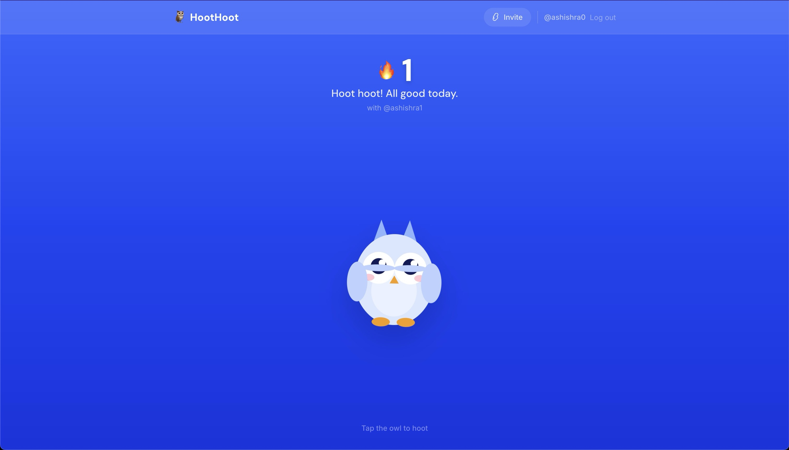
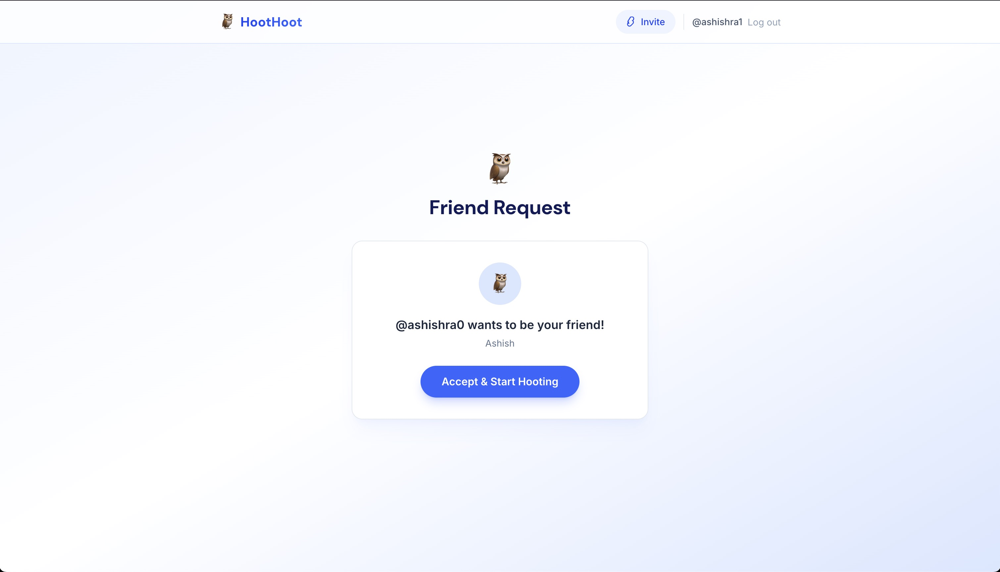
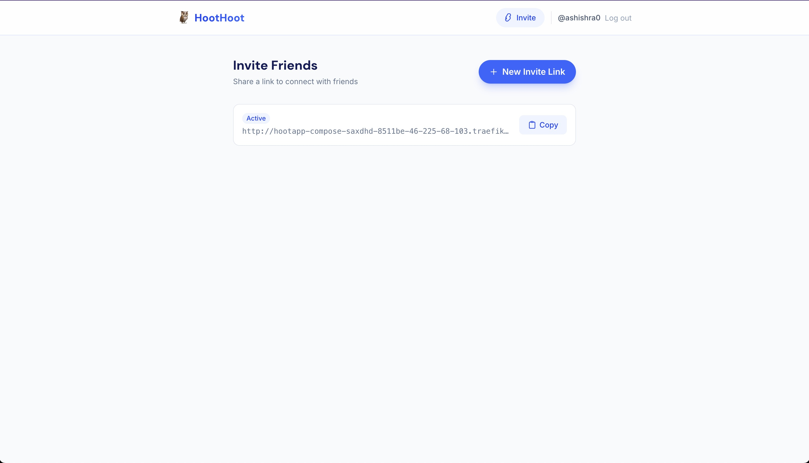
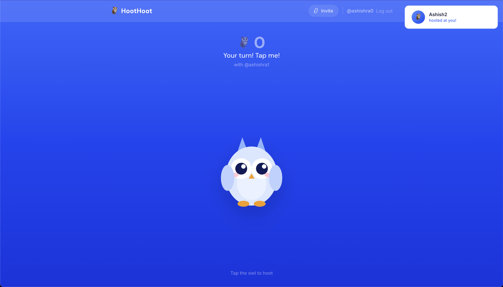
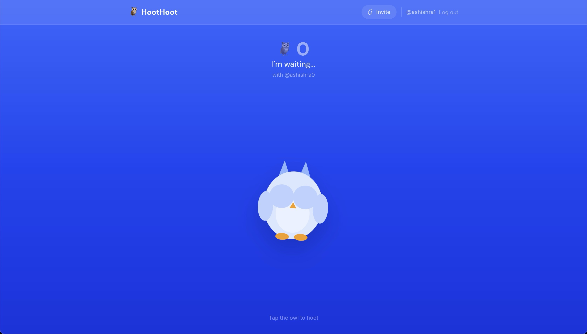

# 🦉 HootHoot

A delightful owl-themed social app to stay connected with friends through daily "hoots" and streaks.



## What is HootHoot?

HootHoot is a simple, fun way to maintain daily streaks with your friends. Just tap the owl once a day to "hoot" at your friends and keep your streak alive!

## Features

### Daily Hoots
Tap your adorable owl companion once per day to send a hoot to your friends. The owl changes moods based on your activity:
- **Waiting**: Ready for your daily hoot
- **Happy**: You've hooted today!
- **Sleepy**: Both friends have hooted, all done for today
- **Celebrating**: Streak milestones!

### 🔥 Streak Tracking
Build daily streaks with friends. The longer you and your friend hoot each day, the higher your streak grows!

### 👥 Friend Invites
Share simple invite links to connect with friends. No complex usernames or friend codes needed.

### ⚡ Real-time Updates
See your friend's hoots instantly with live WebSocket updates powered by ActionCable.

## Tech Stack

- **Framework**: Ruby on Rails 8.1
- **Frontend**: Hotwire (Turbo + Stimulus)
- **Styling**: Tailwind CSS v4
- **Database**: SQLite3 (Solid Queue, Solid Cache, Solid Cable)
- **Background Jobs**: Solid Queue
- **Real-time**: ActionCable with Solid Cable
- **Assets**: Propshaft
- **Server**: Thruster (reverse proxy) + Puma

## Screenshots

### Friend Request


### Invite Friends


### Your Turn to Hoot


### Waiting for Friend


### Streak Complete


## Getting Started

### Prerequisites

- Ruby 3.4.7
- Rails 8.1
- Node.js (for asset compilation)
- SQLite3

### Local Development

1. Clone the repository:
   ```bash
   git clone <your-repo-url>
   cd hoothoot
   ```

2. Install dependencies:
   ```bash
   bundle install
   ```

3. Set up the database:
   ```bash
   bin/rails db:setup
   ```

4. Start the development server:
   ```bash
   bin/dev
   ```

5. Visit `http://localhost:3000`

### Seeded Test Users

The app comes with two test accounts:
- **Alice**: `alice@test.com` / `password123`
- **Bob**: `bob@test.com` / `password123`

They're already friends, so you can test the hooting flow immediately!

## How It Works

### The Hoot Cycle

1. **Morning**: Both friends start with streak count from yesterday
2. **First Hoot**: Friend A taps the owl → Friend B gets a real-time notification
3. **Second Hoot**: Friend B taps back → Both complete the day
4. **Midnight**: Streak increments if both hooted, or resets if either missed

### Streak Logic

The streak system is managed by `StreakService`:
- Both friends must hoot within the same calendar day
- Streaks increment at midnight via `StreakResetJob`
- Miss a day and the streak resets to 0
- All times are in UTC

### Real-time Magic

When you hoot:
1. A `Hoot` record is created
2. `HootNotificationJob` broadcasts via Turbo Stream
3. Your friend's page updates instantly
4. The owl changes mood based on the new state

### Adjusting Streak Rules

Edit `app/services/streak_service.rb` to change:
- When streaks increment
- Reset conditions
- Timezone handling

## Contributing

This is a personal project, but feel free to fork it and make it your own!

## License

MIT License - feel free to use this code for your own projects.

## Acknowledgments

- Built with Rails 8.1
- Inspired by Snapchat streaks and Duolingo's daily practice
- Owl character designed with simple SVG shapes

---

**Hoot hoot!** 🦉✨
